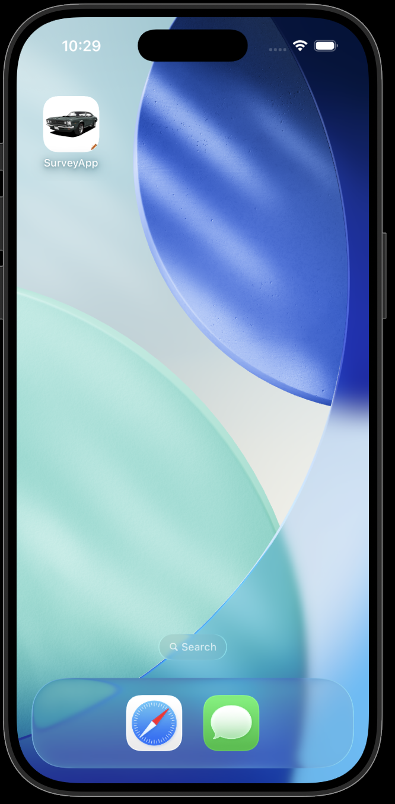
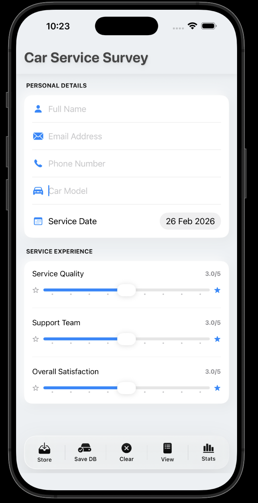
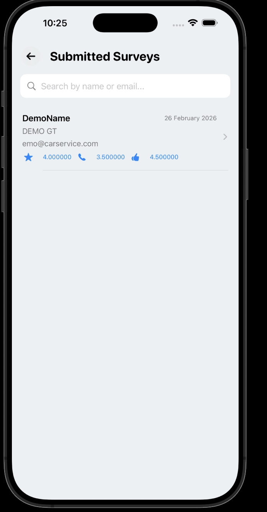
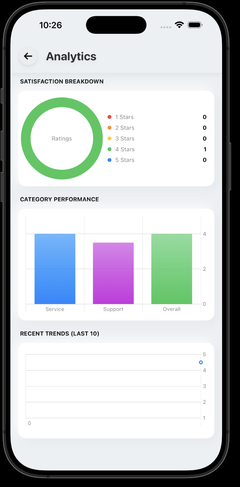

# Car Service Survey App

A simple and clean iOS app built to collect car service feedback and view responses in an organized way.

This app allows users to:

- Submit service feedback  
- Store responses locally  
- View submitted entries  
- See basic insights from the data  

The goal of this project was to practice building a complete app from scratch — from UI design to data handling.

---

## 📱 App Screens

  
  

  
  

---

## 📄 Full Documentation

You can find the detailed project documentation here:

👉 [Project Documentation](https://drive.google.com/file/d/16CZspajGVS-KD8Np0NHfksWLT4HIo6R_/view?usp=sharing)

---

## 🚀 About This Project

This project was built as part of my learning journey in iOS development.  
It focuses on building a real-world structured app rather than just small examples.
